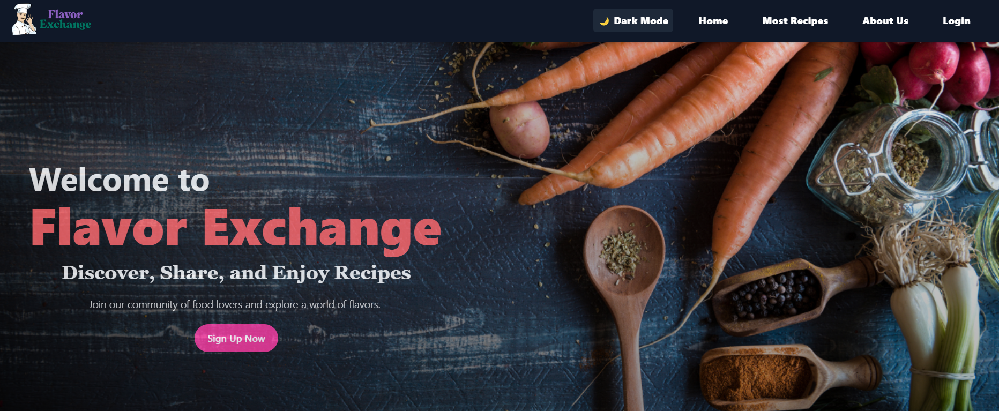
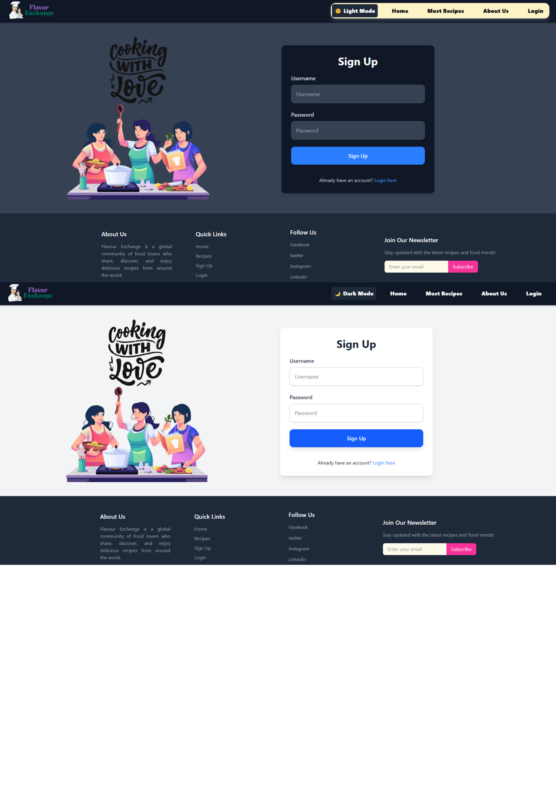
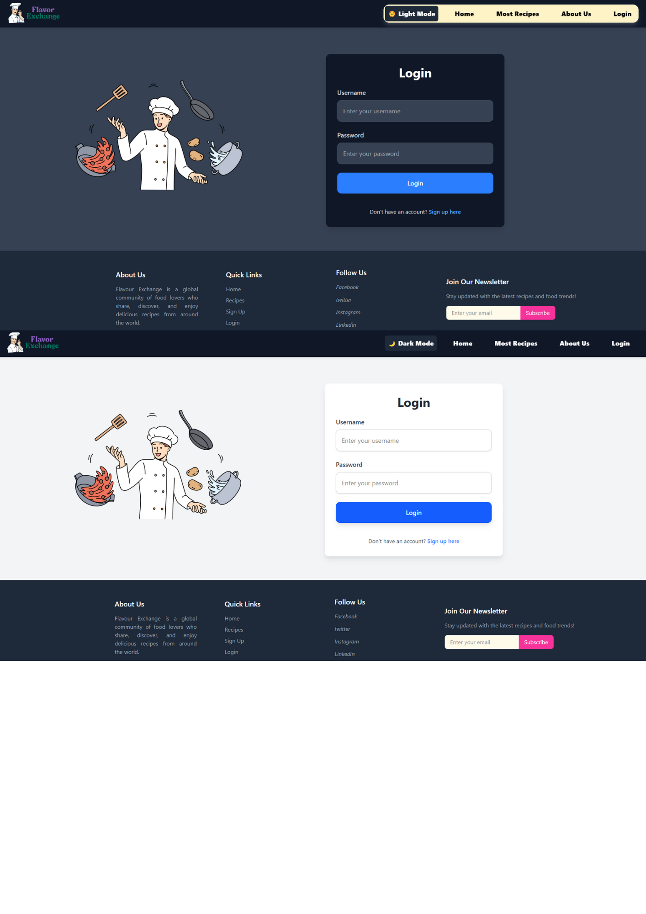
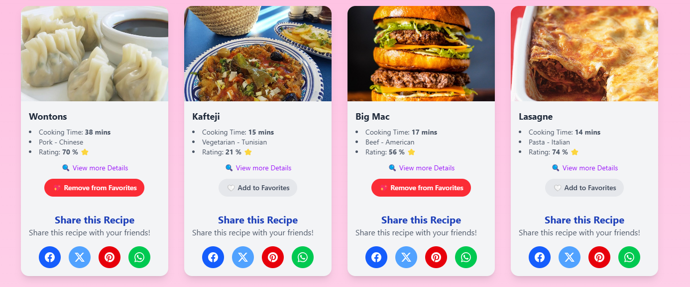
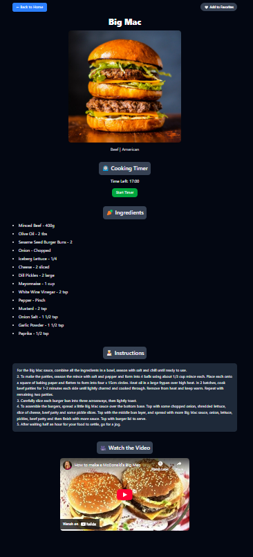

# 🍽️ **Flavor Exchange** — Discover & Share Recipes!

Welcome to **Flavor Exchange**, a dynamic and user-friendly recipe platform where users can discover, share, and manage their favorite dishes. Built with a strong focus on design, interactivity, and user experience, this platform is your go-to place for discovering new flavors and sharing your culinary creations with others.

---

## 🚀 **What I Built**

### 🔹 **Recipe Discovery**
Search and explore delicious recipes from **TheMealDB API** and user-submitted content. Discover new recipes to spice up your meals!

### 🔹 **Add Your Own Recipe**
Get creative! Users can submit their own recipes, including title, ingredients, cooking steps, cooking time, category, and images.

### 🔹 **Favorites System ❤️**
Found a recipe you love? Add it to your personal favorites list and manage them effortlessly. You can view and delete your favorite recipes at any time!

### 🔹 **Authentication**
Currently, mock authentication using `localStorage` lets users log in and access their personalized experience. Real authentication (using Firebase or other backend solutions) is planned for the future.

### 🔹 **Interactive UI/UX**
Built with React.js and styled with Tailwind CSS, the app is designed to be clean, responsive, and mobile-friendly. You’ll love the smooth animations and intuitive interface.

### 🔹 **Video Guide Integration 🎥**
Some recipes include instructional videos to guide you through the cooking process. Perfect for visual learners!

### 🔹 **Dynamic Routing**
Enjoy seamless navigation between pages with React Router, creating a smooth, single-page app experience.

### 🔹 **Local Storage Persistence**
User-added recipes and favorite dishes are stored locally, ensuring your data persists even when you refresh or revisit the site.

---

## 🧰 **Tech Stack**

- **Frontend:** React.js (with Hooks & Router)
- **Styling:** Tailwind CSS + Custom Utility Classes
- **Data Source:** TheMealDB API
- **State Management:** React State
- **Persistence:** localStorage
- **Animations:** Tailwind keyframe animations + transitions
- **Design Tools:** Figma (for initial mockups and layout planning)

---

## 🎯 **Future Improvements**

- **Backend Integration:** Real user authentication and database using Firebase or MongoDB.
- **Advanced Search:** Search by ingredients, categories, and regions.
- **Social Sharing & Recipe Ratings:** Allow users to share recipes on social media and rate their favorites.
- **Dark Mode Toggle:** Implement a dark mode feature for improved accessibility.
  
---

## 📸 **Sneak Peek**

Check out a few images of the app in action:

## Signup Page (DarkMode and LightMode)

## Login Page (DarkMode and LightMode)

## Recipe Cards

## Recipe discription

